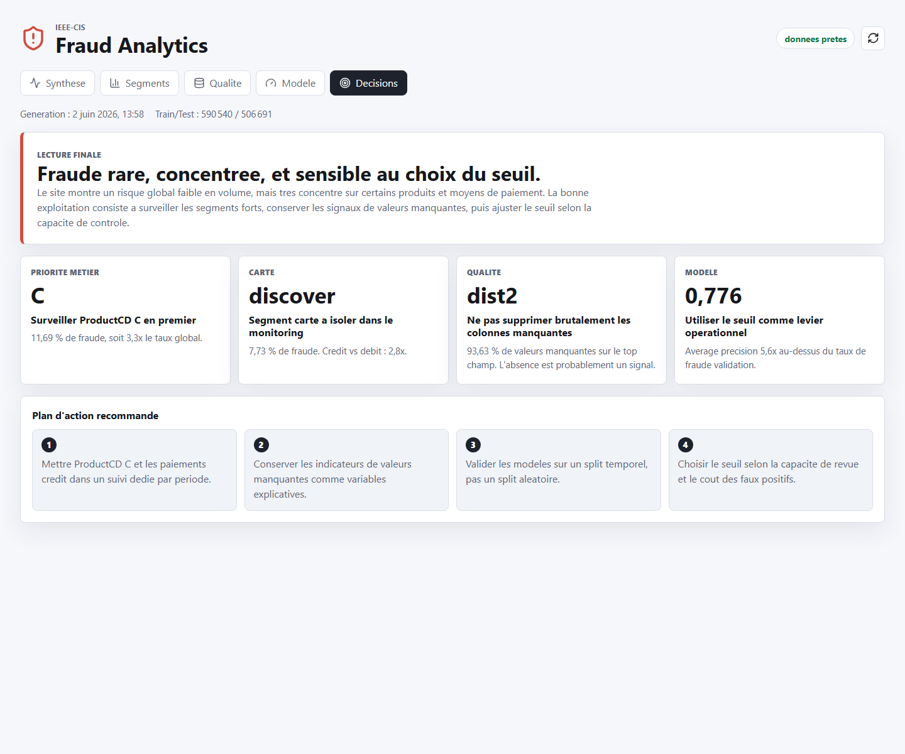

# IEEE-CIS Fraud Detection Dashboard

[](https://github.com/capigit/IEEE-CIS-Fraud-Detection/actions/workflows/deploy-gh-pages.yml)
[](https://capigit.github.io/IEEE-CIS-Fraud-Detection/)
[](https://www.python.org/)
[](https://vitejs.dev/)

Dashboard statique et pipeline d'analyse pour explorer le dataset
**IEEE-CIS Fraud Detection**. Le projet transforme les fichiers Kaggle locaux en
agregats JSON publics, puis les restitue dans une interface React partageable
sur GitHub Pages.

**Dashboard en ligne :**
[capigit.github.io/IEEE-CIS-Fraud-Detection](https://capigit.github.io/IEEE-CIS-Fraud-Detection/)



## Ce Que Montre Le Dashboard

- une restitution executive orientee decision ;
- les volumes train/test, le taux de fraude et la couverture identity ;
- les segments a risque par produit, carte, montant, email et appareil ;
- les champs les plus manquants, utiles pour raisonner sur la qualite data ;
- une baseline de modele avec ROC AUC, precision moyenne, seuils et matrice de
  confusion ;
- une methodologie lisible pour expliquer les choix de validation.

Les onglets sont partageables par ancre :

```txt
#decisions     synthese executive
#overview      volumes, cible, temporalite
#segments      segments et taux de fraude
#missingness   qualite et valeurs manquantes
#model         seuils, metriques, importance des variables
#methodology   methode, limites, validation
```

## Architecture

```txt
src/fraud_analysis/      pipeline Python, validation, exports, baseline modele
web/src/                 dashboard React + TypeScript
web/public/data/         JSON publics consommes par le dashboard
web/public/favicon.svg   icone de l'onglet navigateur
data/raw/                CSV Kaggle locaux, ignores par git
data/processed/          Parquet normalises, ignores par git
data/dashboard/          exports JSON canoniques, ignores par git
reports/                 captures et notes de restitution
```

Les fichiers Kaggle bruts restent locaux. Le site public ne contient que des
agregats JSON dans `web/public/data/`.

## Stack

| Couche | Outils |
| --- | --- |
| Analyse | Python, Polars, pandas |
| Modele | scikit-learn, regression logistique baseline |
| Frontend | Vite, React, TypeScript |
| Visualisation | ECharts, lucide-react |
| Deploiement | GitHub Actions, GitHub Pages |

## Installation

Prerequis :

- Python 3.11+
- Node.js 20+
- les CSV Kaggle dans `data/raw/` ou a la racine du projet

Installation Python :

```bash
python3 -m venv .venv
source .venv/bin/activate
python -m pip install --upgrade pip
python -m pip install -r requirements.txt
```

Sur Windows PowerShell :

```powershell
python -m venv .venv
.\.venv\Scripts\Activate.ps1
python -m pip install --upgrade pip
python -m pip install -r requirements.txt
```

Installation frontend :

```bash
cd web
npm ci
```

## Pipeline Data

Valider les fichiers Kaggle :

```bash
python -m fraud_analysis validate --raw-dir .
```

Generer les Parquet normalises :

```bash
python -m fraud_analysis prepare-processed --raw-dir . --out-dir data/processed
```

Exporter les JSON du dashboard :

```bash
python -m fraud_analysis export-dashboard --raw-dir . --out-dir data/dashboard --publish-dir web/public/data
```

Entrainer la baseline et publier `model.json` :

```bash
python -m fraud_analysis train-model --raw-dir . --out-dir data/dashboard --publish-dir web/public/data
```

Les memes commandes sont disponibles depuis la racine :

```bash
npm run data:validate
npm run data:prepare
npm run data:export
npm run model:train
```

## Dashboard Local

Depuis `web/` :

```bash
npm run dev
npm run build
npm run preview
```

Depuis la racine :

```bash
npm run web:dev
npm run web:build
npm run web:preview
```

Le build produit `web/dist`, pret a etre servi comme site statique.

## Deploiement GitHub Pages

Le workflow [deploy-gh-pages.yml](.github/workflows/deploy-gh-pages.yml)
construit le dashboard et publie `web/dist`.

Avant de pousser sur `main`, verifier que les donnees publiques sont a jour :

```bash
npm run data:export
npm run model:train
npm run web:build
```

Dans GitHub, configurer Pages avec :

```txt
Settings > Pages > Build and deployment > Source: GitHub Actions
```

Le projet utilise `base: "./"` dans Vite et des routes par hash. Il fonctionne
donc sous :

```txt
https://capigit.github.io/IEEE-CIS-Fraud-Detection/
```

## Notes De Donnees

- `data/raw/`, `data/processed/`, `data/dashboard/`, `web/dist/` et les
  environnements virtuels sont ignores par git.
- `web/public/data/*.json` est versionne volontairement : ce sont les agregats
  servis par GitHub Pages.
- `.nojekyll` est inclus pour que GitHub Pages serve les assets statiques sans
  transformation Jekyll.
